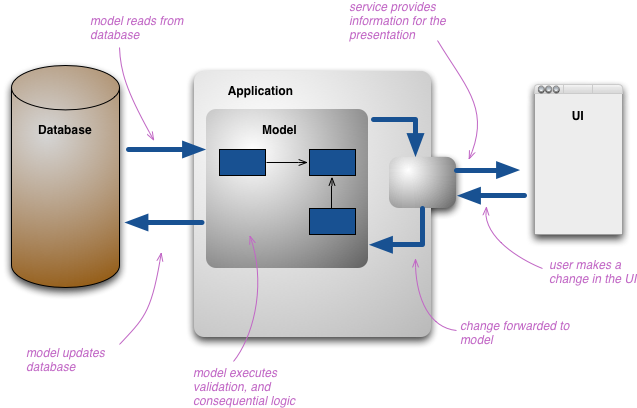

# **Commands, Queries, and Façades**

Lukáš Daubner

---

# Contents

* CQRS (Command Query Responsibility Segregation) Pattern
* Mediator Pattern and MediatR Library
* Façade Pattern

---

# **CQRS (Command Query Responsibility Segregation)**

---

# Why CQRS

* Models the reads (queries) and changes (commands) independently
* Enables separation of "read" and "write" data store
* Independent scaling of reads/writes
* Optimization of data schemes

---

# Without CQRS

<!--
footer: Image by Martin Fowler (https://www.martinfowler.com/bliki/CQRS.html)
-->



---

# With CQRS

<!--
footer: Image by Martin Fowler (https://www.martinfowler.com/bliki/CQRS.html)
-->


---

<!--
footer: ""
-->

# Query

* Encapsulated query to a data store
* Does not change a state
* Plain object
* Encapsulates what you are asking for
* Similar concept to QueryObject, but it is typically purpose-made

---

# Command

* Does change a state
* Plain object
* Does not return value
* Encapsulates request into an object
* It is also a pattern
* Easy to implement "undo" operation 

---

# When to use CQRS


<div class="columns">
<div>

## **Dos**

* Collaborative, parallel apps
* Reads and writes are disproportional
* Interface is task-focused 
* Different model versions
* Integration with other systems
* Event Sourcing

</div>
<div>

## **Don'ts**

* Simple app
* Interface is CRUD-focused

</div>
</div>

---

# Implementing CQRS

* By hand
  - Create "Handlers" classes which will process commands/queries
* Mediator
  - Decouple the processing using a Mediator pattern
  - MediatR library
---

# **Mediator & MediatR**

---

# Mediator

* Reduction of dependencies between objects
  - When "everyone talks to everyone"
* Communication between objects is "mediated" by a single object
* Eases reuse as components are independent
* Beware of creating a God Object

---

# Mediator

<!--
footer: Image by Refactoring Guru (https://refactoring.guru/)
-->

<center>

</center>

---

# MediatR

<!--
footer: ""
-->

* .NET library implementing Mediator pattern
* In-process messaging
* Supports pipelines (aspect-like interceptors)
* *IRequest* - Message that will be send
* *IRequestHandler* - Message consumer

---

# CQRS with MediatR

## Command

```CSharp
    public class EnrollToCourseCommand : IRequest
    {
        public Course Course { get; set; }
        public Guid UserId { get; set; }
        public string ContactEmail { get; set; }
    }
```

---

# CQRS with MediatR

## Command Handler

```CSharp
    public class EnrollToCourseCommandHandler : IRequestHandler<EnrollToCourseCommand>
    {
        private IEnrollmentRepository _enrollmentRepository;

        public EnrollToCourseCommandHandler(IEnrollmentRepository enrollmentRepository)
        {
            _enrollmentRepository = enrollmentRepository;
        }

        public async Task<Unit> Handle(EnrollToCourseCommand request, CancellationToken cancellationToken)
        {
          // Handling code
        }
    }
```

---

# CQRS with MediatR

## Query

```CSharp
    public class GetCoursesQuery : IRequest<IEnumerable<Course>>
    {
        // Option is (one of) implementation of Maybe monad in C#
        // It is safe way of expressing null object, without actually using nulls
        public Option<DateTime> Before { get; init; }
        public Option<DateTime> After { get; init; }
        public Option<string> AtLocation { get; init; }
    }
```

---

# CQRS with MediatR

## Query Handler

```CSharp
    public class GetCoursesQueryHandler : IRequestHandler<GetCoursesQuery, IEnumerable<Course>>
    {
        private ICourseRepository _courseRepository;
        public GetCoursesQueryHandler(ICourseRepository courseRepository)
        {
            _courseRepository = courseRepository;
        }

        public async Task<IEnumerable<Course>> Handle(GetCoursesQuery request, CancellationToken cancellationToken)
        {
            // Handling code
        }
    }
```

---

# **Demo**

---

# CQRS Task

* Implement Query for pending enrollment of a single user
* Implement Command for canceling an enrollment
* *HINT*: Use the console project for testing. Dependency injection is automated, so don't worry about it, yet.
* *HINT*: Focus on the BL project. But feel free to implement new method in the repository.
* *Bonus*: How would you handle rollbacks? What if during enrollment the email is not send? Can you fix it?

---

# **Façade**

---

# Façade

* Provides a simpler interface
* Hides underlining complexity of library/framework/etc...
* Facade do not need to implement everything just the most important stuff. The complex things can be done without facade.
  - Think how Newtonsoft.JSON API is implemented
* It is basically just a single class that is delegating work to others

---

# Façade

<!--
footer: Image by Refactoring Guru (https://refactoring.guru/)
-->

<center>

</center>

---

<!--
footer: ""
-->

# Façade Task

* Create a Facade for your CQRS infrastructure
* Implement a Facade that easily exposes the core functionality
  - Hiding the underlining complexity and usage of MediatR
  - Try to make it as simple as possible. Just a few method calls
